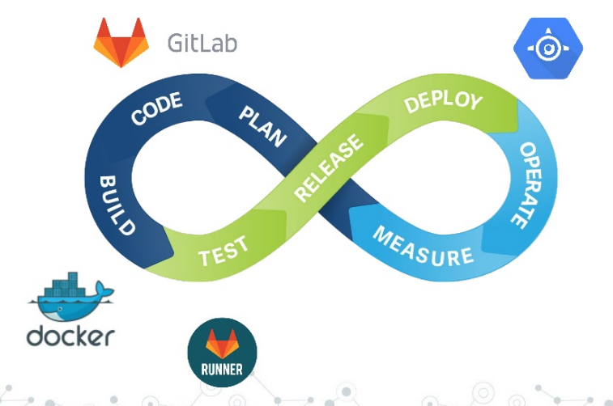

+++
title = "Pipelines Terraform no GitLab"
description = "Pipelines Terraform no GitLab"
date = 2019-12-05T12:33:00Z
draft = false
slug = "terraform-pipelines-in-gitlab"

[taxonomies]
categories = ["Desenv", "DevOps", "Linux"]
tags = ["devops", "git", "gitlab", "ci/cd", "linux", "terraform"]

[extra]
author = "jniltinho"
comments = true
+++



## O que é o GitLab?

O GitLab é um serviço Git hospedado, bem como o GitHub. Você pode ter ouvido falar deles recentemente desde uma certa aquisição e o movimento #movingtogitlab. Se você não gosta de serviços hospedados, o GitLab fornece um servidor autônomo que pode ser implantado no local ou na nuvem e, louvávelmente, a maior parte do desenvolvimento de seus produtos para servidores é de código aberto.

O GitLab é um defensor do DevOps há muito tempo e agrupa uma tonelada de ferramentas úteis em seus produtos, incluindo quadros Kanban e um sistema completo de CI / CD. Você pode até usar o GitLab apenas para os recursos de CI / CD se o seu repositório git estiver em outro lugar.

Existem alguns conceitos fundamentais para a abordagem do GitLab ao IC, que fazem sentido quando você está acostumado a eles, mas podem afetar sua decisão de usá-lo em seu projeto:

1. Todo repositório possui uma única configuração de pipeline, declarada em um arquivo .gitlab-ci.yml
2. Cada confirmação no repositório acionará uma execução desse pipeline
3. Isso significa que não é necessário solicitar variáveis a um usuário (se você está acostumado a parametrizar trabalhos de Jenkins, isso pode ser um choque)


## Começando

Este tutorial pressupõe que você criou uma conta gratuita no gitlab.com, mas também pode seguir sozinho com um servidor independente. Crie um novo projeto e adicione sua chave SSH para uso conveniente do git (o GitLab solicitará que você faça isso).

Em seguida, adicione algumas configurações do Terraform ao seu repositório. Você pode usar os arquivos de exemplo da minha introdução à postagem do Terraform que constroem um cluster GKE básico. Você também precisará configurar o estado remoto, que é detalhado na minha postagem de pipelines anterior.

Este tutorial é realmente sobre os pipelines do GitLab em particular, portanto, se você precisar de mais detalhes, volte e leia rapidamente essas postagens. Se você precisar de uma atualização sobre o Git, dê uma olhada aqui.

Por fim, adicione um arquivo .gitignore que exclua o diretório creds que você criou (se você seguiu as postagens anteriores). Você não deseja confirmar as credenciais da sua conta de serviço no git! Por fim, seu repositório local deve ficar assim:

```quote
.gitignore
creds/serviceaccount.json
backend.tf
gkecluster.tf
provider.tf
```

## Vídeo Howto do Gitlab-CI

{{ youtube(id="wDjZGkfphbk") }}


**Nota:** Esse artigo precisa ser melhorado ...

----

## Links

* [Post Original](https://medium.com/@timhberry/terraform-pipelines-in-gitlab-415b9d842596)