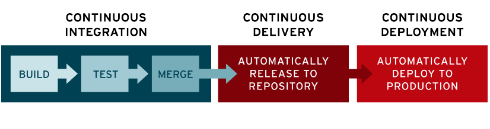

+++
title = "Pipelines Terraform no GitLab"
description = "Pipelines Terraform no GitLab"
date = 2019-12-05T12:33:00Z
draft = false
slug = "terraform-pipelines-in-gitlab"

[taxonomies]
categories = ["DevOps", "Terraform", "Cloud"]
tags = ["devops", "git", "gitlab", "ci/cd", "cloud", "terraform"]

[extra]
author = "jniltinho"
comments = true
+++


## O que é CI/CD?

CI/CD é um método para entregar aplicações com frequência aos clientes. Para isso, é aplicada a automação nas etapas do desenvolvimento de aplicações. Os principais conceitos atribuídos a esse método são integração, entrega e implantação contínuas. Com o CI/CD, é possível solucionar os problemas que a integração de novos códigos pode causar para as equipes de operações e desenvolvimento (o famoso “inferno de integração”).

Especificamente, o CI/CD aplica monitoramento e automação contínuos a todo o ciclo de vida das aplicações, incluindo as etapas de teste e integração, além da entrega e implantação. Juntas, essas práticas relacionadas são muitas vezes chamadas de "pipeline de CI/CD" e são compatíveis com o trabalho conjunto das equipes de operações e desenvolvimento com métodos ágeis.

## Qual é a diferença entre CI e CD (e o outro CD)?

O acrônimo CI/CD tem alguns significados. "CI" sempre se refere à integração contínua, que é um processo de automação para desenvolvedores. A CI é bem-sucedida quando novas mudanças no código de uma aplicação são desenvolvidas, testadas e consolidadas regularmente em um repositório compartilhado. É a solução ideal para evitar conflitos entre ramificações quando muitas aplicações são desenvolvidas ao mesmo tempo.

"CD" se refere à entrega contínua e/ou à implantação contínua, conceitos relacionados e usados alternadamente às vezes. Em ambos os casos, se trata da automação de fases avançadas do pipeline, mas são usados às vezes separadamente para ilustrar o nível de automação presente.

Geralmente, a entrega contínua representa as mudanças feitas pelo desenvolvedor em uma aplicação, que são automaticamente testadas contra bugs e carregadas em um repositório, como o GitHub, ou em um registro de container. Nesse repositório, a equipe de operações pode implantar essas mudanças em um ambiente de produção ativo. Isso resolve o problema de baixa visibilidade e comunicação entre as equipes de negócios e desenvolvimento. Para isso, a finalidade da entrega contínua é garantir o mínimo de esforço na implantação de novos códigos.

A implantação contínua, outro significado para "CD", se refere ao lançamento automático das mudanças feitas por um desenvolvedor do repositório à produção, onde podem ser usadas pelos clientes. Isso evita a sobrecarga das equipes de operações por conta dos processos manuais que atrasam a entrega de aplicações. Nesse conceito, são aproveitados os benefícios da entrega contínua ao automatizar a próxima etapa no pipeline.



Na abordagem de CI/CD, é possível especificar apenas as práticas relacionadas da integração e entrega contínuas ou as práticas dessas duas mais as da implantação contínua. Ainda há outra questão que dificulta o entendimento: às vezes, o termo “entrega contínua” é usado englobando também os processos da implantação contínua.

Por fim, não vale a pena se prender a esses conceitos. Basta se lembrar de que o CI/CD é na verdade um processo, muitas vezes visto como um pipeline, que envolve a inclusão de um alto nível de automação e monitoramento contínuos no desenvolvimento de aplicações. Em cada caso, o que esses termos querem dizer depende da quantidade de automação implantada no pipeline de CI/CD. Muitas empresas começam adicionando CI e depois trabalham para automatizar a entrega e implantação. Por exemplo, como parte de aplicações nativas na nuvem.

## Integração contínua

No desenvolvimento moderno de aplicações, o objetivo é que muitos desenvolvedores trabalhem ao mesmo tempo em diferentes recursos na mesma aplicação. No entanto, se uma organização tiver que consolidar todo o código-fonte de ramificação em apenas um dia (conhecido como “merge day” ou “dia de consolidação”), o trabalho poderá ser entediante, manual e demorado. Isso acontece porque a mudança realizada em uma aplicação por um desenvolvedor que trabalha isoladamente pode entrar em conflito com outras feitas ao mesmo tempo pelos colegas. Esse problema pode ser agravado se cada desenvolvedor tiver seu próprio ambiente de desenvolvimento integrado (IDE) local personalizado. O ideal seria que a equipe entrasse em acordo com apenas um IDE baseado em nuvem.

Com a integração contínua (CI), os desenvolvedores consolidam as mudanças no código de volta a uma ramificação compartilhada ou “tronco” com mais frequência (às vezes, até diariamente). As mudanças são consolidadas e depois validadas através da criação automática da aplicação. Vários testes automatizados, geralmente de unidade e integração, são feitos para garantir que as mudanças não corromperam a aplicação. Basicamente, tudo é testado, incluindo classes, funções e diferentes módulos que formam toda a aplicação. Em caso de conflito entre os códigos novos e existentes, a CI facilita a correção desses bugs com rapidez e frequência.

## Entrega contínua

Depois de realizar a automação de compilações e da unidade e os testes de integração na CI, a entrega contínua automatiza o lançamento desse código validado em um repositório. Portanto, para ter um processo eficaz de entrega contínua, é importante que a CI já esteja integrada ao pipeline de desenvolvimento. O objetivo da entrega contínua é garantir uma base de códigos que esteja sempre pronta para implantação em um ambiente de produção.

Cada etapa da entrega contínua, da consolidação das mudanças de código à entrega de compilações prontas para produção, inclui a automação do lançamento de códigos e do teste. No final desse processo, a equipe de operações pode implantar uma aplicação na produção com rapidez e facilidade.

## Implantação contínua

A etapa final de um pipeline de CI/CD sólido é a implantação contínua. Ela é um complemento da entrega contínua, que automatiza o lançamento de compilações prontas para produção em um repositório de códigos. A implantação contínua automatiza o lançamento de uma aplicação para a produção. Como não há um canal manual na etapa do pipeline antes da produção, a implantação contínua depende muito da automação otimizada dos testes.

Na prática, a implantação contínua significa que a mudança do desenvolvedor em uma aplicação será habilitada depois de alguns minutos após a gravação (supondo que ela seja aprovada no teste automatizado). Isso facilita muito mais o recebimento do feedback dos usuários e a incorporação dele. Juntas, todas essas práticas de CI/CD relacionadas diminuem o risco da implantação de aplicações, facilitando o lançamento das mudanças em pequenas partes, e não de uma só vez. No entanto, há também a necessidade de muitos investimentos iniciais, já que os testes automatizados precisam ser gravados para acomodar várias etapas de teste e lançamento no pipeline de CI/CD.

## Vamos falar do GitLab


O [GitLab](https://gitlab.com) é um serviço que hospeda projetos Git, similar ao [GitHub](https://github.com/). Eu mesmo hospedo alguns de [meus projetos](https://gitlab.com/jniltinho) no GitLab. Se você não gosta de serviços hospedados, o GitLab fornece um servidor autônomo que pode ser implantado no local ou na nuvem, a maior parte do desenvolvimento de seus produtos para servidores é de código aberto.

O GitLab é um defensor do DevOps há muito tempo e agrupa uma tonelada de ferramentas úteis em seus produtos, incluindo quadros Kanban e um sistema completo de CI/CD. Você pode até usar o GitLab apenas para os recursos de CI/CD se o seu repositório git estiver em outro lugar.

Existem alguns conceitos fundamentais para a abordagem do GitLab ao IC, que fazem sentido quando você está acostumado a eles, mas podem afetar sua decisão de usá-lo em seu projeto:

1. Todo repositório possui uma única configuração de pipeline, declarada em um arquivo .gitlab-ci.yml
2. Cada confirmação no repositório acionará uma execução desse pipeline
3. Isso significa que não é necessário solicitar variáveis a um usuário (se você está acostumado a parametrizar trabalhos de Jenkins, isso pode ser um choque)


## Começando

Este tutorial pressupõe que você criou uma conta gratuita no [GitLab](https://gitlab.com), mas também pode seguir sozinho com um servidor independente. Crie um novo projeto e adicione sua chave SSH para uso conveniente do git (o GitLab solicitará que você faça isso).

Em seguida, adicione algumas configurações do Terraform ao seu repositório. Você pode usar os arquivos de exemplo da minha introdução à postagem do Terraform que constroem um cluster GKE básico. Você também precisará configurar o estado remoto, que é detalhado na minha postagem de pipelines anterior.

Este tutorial é realmente sobre os pipelines do GitLab em particular, portanto, se você precisar de mais detalhes, volte e leia rapidamente essas postagens. Se você precisar de uma atualização sobre o Git, dê uma olhada aqui.

Por fim, adicione um arquivo .gitignore que exclua o diretório creds que você criou (se você seguiu as postagens anteriores). Você não deseja confirmar as credenciais da sua conta de serviço no git! Por fim, seu repositório local deve ficar assim:

```quote
.gitignore
creds/serviceaccount.json
backend.tf
gkecluster.tf
provider.tf
```

## Vídeo Howto do Gitlab-CI

{{ youtube(id="wDjZGkfphbk") }}


**Nota:** Esse artigo vai ser melhorado em breve ...

----

## Links

* [Post Original](https://medium.com/@timhberry/terraform-pipelines-in-gitlab-415b9d842596)
* [Do zero ao deploy #1](https://www.youtube.com/watch?v=wDjZGkfphbk)
* [Do zero ao deploy #2](https://www.youtube.com/watch?v=L69ZBHIqPZo)